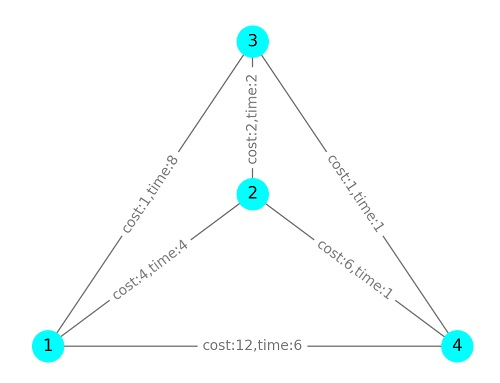
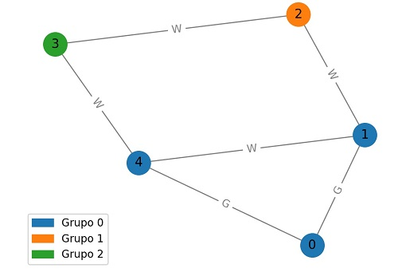
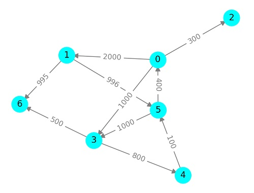
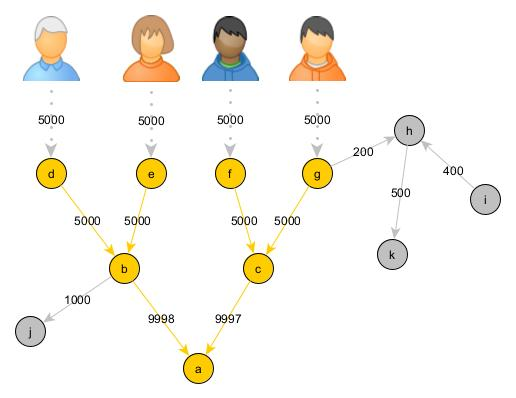

# Exercício Prático 01 (EP01)

Este repositório apresenta um template para a execução da avaliação EP01. O objetivo desta atividade é construir funções em Python, usando o pacote [NetWorkX](https://networkx.org/) que implementem as tarefas indicadas nas questões a seguir. Use a estrutura já disponível neste template. 

**Orientações Gerais**:
* Para carregar o submodulo gtufcg, execute os seguintes comandos no folder principal do repositório, após a clonagem:

      git submodule init

      git submodule update

* Não altere a estrutura do repositório ou modifique nomes dos arquivos ou folders;

* Não altere arquivos da pasta test;

* Implemente as funções ou testes solicitados sem realizar qualquer alteração em sua assinatura (nomes e parâmetros), visto que esta avaliação terá como parte de sua correção a execução de testes automáticos;

* Os grupos devem implementar as soluções exclusivamente através da representação e manipulação de grafos usando NetworkX juntamente com construções gerais de Python quando indispensável;

* Apresente documentação (comentários no código) para descrever a solução desenvolvida. Evite documentar em excesso, apenas o mínimo necessário para facilitar a compreensão do código;

* Organize o código de forma consistente para facilitar sua legibilidade. Por exemplo, evite espaçamentos entre linhas ou identação inconsistentes; use nomes de funções/variáveis significativos;

* Cada grupo deverá realizar este trabalho de forma individual apresentando sua própria resposta. As respostas serão inspecionadas visualmente e mecanicamente com ferramentas especializadas. Nesta inspeção, caso seja detectada cópia de resposta, o(s) grupo(s) envolvido(s) sofrerão penalidade na nota e poderão ficar com nota 0;

* É importante salientar que é de responsabilidade do grupo manter o sigilo sobre sua solução. Para tal, não deixe sua solução em locais de visibilidade pública e acesso trivial;

* O trabalho deve ser realizado estritamente em grupo. A realização e entrega individual será penalizada com diminuição de 30% do valor da nota. Casos excepcionais, tais como assistência domiciliar ou desistência/indisponibilidade de membro(s) do grupo devem ser comunicados com antecedência.

**Entrega:**

* Realizar push com a versão final do repositório até o prazo definido no classroom;
* Confira o status da execução automática dos testes na aba Actions;
* Caso seu projeto contenha algum erro de compilação, nenhum teste será executado e, portanto, não poderá ser corrigido;
* A participação de cada membro será comprovada através do histórico de edições e commits do repositório. A nota será dada apenas para aqueles que editarem efetivamente o repositório;
* Caso o repositório seja editado após o prazo para entrega, a atividade será considerada como reposição.

## Questão 01

Escreva uma função, **best_path**, que encontra o menor caminho em um grafo `G`
de um vértice `s` para um vértice `t`, passando por 
todos os vértices na lista `stops`, na *ordem* definida pela lista.
O vértice `s` tem que ser diferente de `t` e estes vértices não podem estar incluídos em `stops`.
A função deve retornar uma lista de vértices que representa o caminho.
Se o caminho não existir, a função deve retornar uma lista vazia.

Como exemplo, considere o grafo abaixo:
      
$V(G_1) = \lbrace 0, 1, 2, 3, 4\rbrace$
      
$E(G_1) = \lbrace 01, 12, 23, 34, 40 \rbrace$

Para as chamadas abaixo, a função deve retornar:
      
    best_path(G1, 0,[1],3) retorna a lista: [0,1,2,3]
    best_path(G1, 0,[2],3) retorna a lista: [0,1,2,3]
    best_path(G1, 0,[1,2],3) retorna a lista: [0,1,2,3]
    best_path(G1, 0,[],3) retorna a lista: [0,4,3]
    best_path(G1, 0,[2,1],3) retorna a lista: []

**Arquivos**:
* src/Q01.py (local onde a função deve ser construída)
* test/test_Q01.py (testes automáticos)
* main_Q01.py (exemplo de uso da função)

**Execução dos testes automáticos** (use python ou a denominação específica para python na sua máquina):

      python -m unittest -v test/test_Q01.py

## Questão 02

Considere um grafo que modela pontos de interesse em uma certa região
como vértices e os acessos entre estes pontos como arestas.
Cada aresta possui como atributos o tempo (*time*) e o custo (*cost*) de deslocamento 
de um ponto ao outro.

Escreva uma função, **short_time_by_cost**, que recebe como entrada:
  - `G` - um grafo cujas arestas possuem os atributos numéricos *time* e *cost* do tipo int ($\ge 0$)
  - `s` e `t` - pontos diferentes de interesse origem e destino
  - `threshold` - limite de custo do tipo int ($\ge 0$)
    
 A função retorna um caminho de menor tempo que pode ser realizado considerando o limite
 de custo estabelecido.

O retorno deve ter o seguinte formato:
 - (tempo,caminho) - se existir pelo menos um caminho dentro do limite de custo e este será o de menor tempo dentre os possíveis
 - (-1,[]) - se não existir um caminho dentro do limite de custo

 Como exemplo, considere o seguinte grafo:

Seja G2 o grafo acima. A função deve retornar o seguinte para cada chamada:
 
      short_time_by_cost(G2,1,4,10) retorna (5, [1, 2, 4])
      short_time_by_cost(G2,1,4,7) retorna (7, [1, 2, 3, 4])
      short_time_by_cost(G2,1,4,3) retorna (9, [1, 3, 4])
      short_time_by_cost(G2,1,4,2) retorna (9, [1, 3, 4])
      short_time_by_cost(G2,1,4,1) retorna (-1, [])

**Arquivos**:
* src/Q02.py (local onde a função deve ser construída)
* test/test_Q02.py (testes automáticos)
* main_Q02.py (exemplo de uso da função)

**Execução dos testes automáticos** (use python ou a denominação específica para python na sua máquina):

      python -m unittest -v test/test_Q02.py

## Questão 03
Considere um grafo que modela um conjunto de pontos de interesse e suas conexões em uma certa localização. 
Neste grafo, os pontos de interesse são definidos pelos vértices e as arestas relacionam dois pontos 
que podem ser alcançados diretamente. Cada aresta possui um atributo indicando o tipo conexão, 
que pode ser por terra (G) ou aquática (W). Como exemplo, temos o grafo abaixo. Podemos observar que os pontos 1, 0 e 4 podem ser alcançados mutuamente em um meio de transporte por terra, mas, para sair de qualquer um destes pontos para os pontos 2 ou 3, é necessário realizar uma conexão em um meio de transporte aquático.

Escreva a função **find_grops**, que encontram grupos de pontos de interesse que podem ser mutuamente alcançados por terra. A função recebe um grafo simples conectado no formato definido acima e retorna uma lista de listas onde cada lista representa um grupo.
Para o exemplo acima, a função deve retornar os seguintes grupos, não necessariamente nesta ordem:

    [[0, 1, 4], [2], [3]]

> Dica: 
> Utilize o conceito de corte de arestas para identificar os vértices que podem ser atingidos diretamente a partir de um certo grupo. Considerando o exemplo acima e gradativamente construindo os grupos podemos proceder da seguinte forma. Considere que o primeiro grupo começa com o vértice $4$. Observe que $\partial(\lbrace 4\rbrace) = \lbrace 43,40,41\rbrace$. Como existe pelo menos uma aresta com atributo G, aresta `40`, devemos incluir seu outro terminal no conjunto. Agora, observe que $\partial(\lbrace 0,4\rbrace) = \lbrace 43,41,01\rbrace$. De forma análoga, incluimos o vértice $1$ no grupo. Agora, observe que $\partial(\lbrace 0,4,1\rbrace) = \lbrace 43,12\rbrace$. Neste caso, como o corte só possui arestas do tipo `W`, fechamos o primeiro grupo com $\lbrace 4,0,1\rbrace$. Usamos um procedimento semelhante para os vértices ainda não incluídos em grupos até que todos os vértices façam parte de algum grupo.

**Arquivos**:
* src/Q03.py (local onde a função deve ser construída)
* test/test_Q03.py (testes automáticos)
* main_Q03.py (exemplo de uso da função)

  **Execução dos testes automáticos** (use python ou a denominação específica para python na sua máquina):

      python -m unittest -v test/test_Q03.py

## Questão 04

Considere um grafo direcionado que modela transações realizadas entre correntistas de diferentes agências financeiras.
Neste grafo, cada vértice representa uma pessoa que pode ter atributos como:

      SSN, first_name, last_name, email, gender, phone_number, street, street_number, city, country

Cada arco (`person_id1`, `person_id2`), onde `person_id1` e `person_id2` são os identificadores SSN das pessoas, representa o fato de que uma pessoa, `person_id1`, realizou uma transferência para uma conta da outra, `person_id2`. Os arcos possuem um atributo,  `amount`, que é o valor da transação. 
Por simplicidade, nesta questão e na Questão 05, consideraremos apenas os atributos SNN de pessoas.

Como exemplo, considere o grafo abaixo, onde temos pessoas com SSN de 0 a 6:

Escreva a função **max_income** que recebe um grafo com transações de
correntistas como entrada no formato descrito acima e retorna o total máximo em transferências recebidas por uma pessoa e uma lista de todas as pessoas que receberam este valor total
como transferência. 

Considerando o exemplo acima, a função deve retornar (a lista deve conter os mesmos elementos em qualquer ordem):

      (2000.0, ['3', '1'])

**Arquivos**:
* src/Q04.py (local onde a função deve ser construída)
* test/test_Q04.py (testes automáticos)
* main_Q04.py (exemplo de uso da função)

  **Execução dos testes automáticos** (use python ou a denominação específica para python na sua máquina):

      python -m unittest -v test/test_Q04.py

## Questão 05
"[*Anti-money laundering (AML) and graph analytics is a match made in heaven.*](https://linkurious.com/blog/anti-money-laundering-use-cases-graph-analytics/)"

Fraudes do tipo lavagem de dinheiro (*money laundering*) podem ocorrer constantemente em sistemas bancários causando sérios prejuízos a instituições financeiras ou a sociedade. Tais fraudes são de difícil detecção devido ao enorme número de transações que normalmente ocorre em um curto período de tempo. 

Através da busca por padrões em grafos, podemos detectar possíveis casos de fraude. Como exemplo, temos o padrão *structuring* ou *smurfing*. Neste padrão, ao invés de realizar um depósito com um valor alto diretamente em uma conta corrente, este valor é fragmentado e depositado inicialmente em várias contas. Em seguida, são feitas sucessivas transferências em diferentes camadas até que o valor total chega ao seu destino. Um exemplo de estrutura que modela este padrão é apresentada em destaque no dígrafo abaixo (vértice e arestas em amarelo). Esta estrutura é um dígrafo acíclico na forma de uma árvore enraizada com orientação reversa. Neste exemplo, temos duas camadas de transferências. Note que a soma dos depósitos iniciais (primeira camada) e finais (última camada) costuma divergir para disfarçar a ação.

Escreva a função **detect_smurfing** que recebe como entrada um grafo `G` que modela transações de transferências bancárias como na Questão 4, `nbranch` ($\ge 2$) que representa o número de transferências que cada pessoa recebe, `n_layer` ($\ge 2$) que representa o número de camadas da estrutura, `threshold` que é o limite percentual de perda do valor inicial até o destino ($0 \le threshold \le 1$). Com base nos valores de `nbranch` e `n_layer`, a função deve usar o seguinte grafo como padrão para detectar os casos de smurfing:

      P = nx.reverse_view(nx.balanced_tree(n_branch,n_layer,nx.DiGraph))

Esta estrutura representa uma orientação reversa de uma árvore balanceada enraizada dos vértices folha até a raiz. Para detectar o exemplo da figura acima, usamos uma árvore com n_branch = 2 e n_layer = 2.
A função deverá buscar por este padrão no grafo e retornará apenas os casos em que a diferença entre a soma das transferências iniciais, *soma_inicial*, e a soma das transferências finais, *soma_final*, não ultrapasse o valor do percentual do `threshold` sobre *soma_inicial*. Para cada caso detectado, a função retorna:

      (soma_inicial, soma_final, destino, envolvidos)

onde *destino* é o vértice que representa o destino final das transferências e *envolvidos* é a lista de todos que participaram do esquema.

Para o exemplo acima, a saída esperada é:

      [(20000.0, 19995.0, 'a', ['a', 'b', 'c', 'd', 'e', 'f', 'g'])]

> Dica:
> Utilize o conceito de incorporação em grafos (isoformismo a subgrafos) criando uma instância da classe [isomorphism.DiGraphMatcher](https://networkx.org/documentation/stable/reference/algorithms/isomorphism.vf2.html#digraph-matcher) e a função `subgraph_isomorphisms_iter` para obter os isomorfismos da estrutura P ilustrada acima para subgrafos do grafo de transação.

**Arquivos**:
* src/Q05.py (local onde a função deve ser construída)
* test/test_Q05.py (testes automáticos)
* main_Q05.py (exemplo de uso da função)

  **Execução dos testes automáticos** (use python ou a denominação específica para python na sua máquina):

      python -m unittest -v test/test_Q05.py
