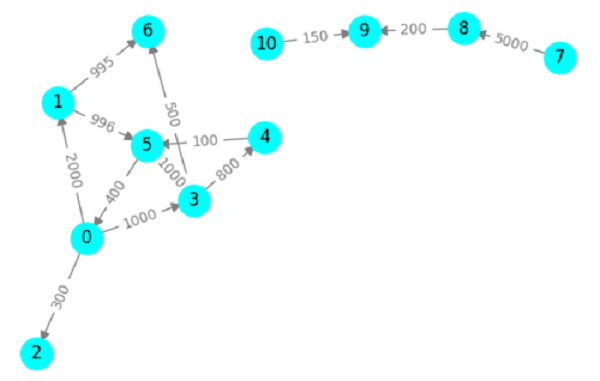
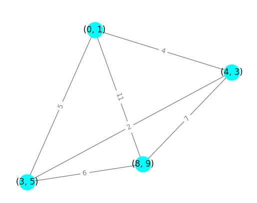
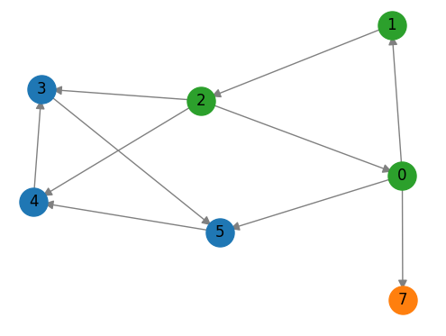
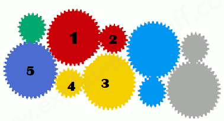
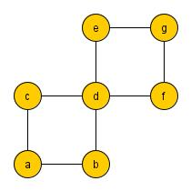
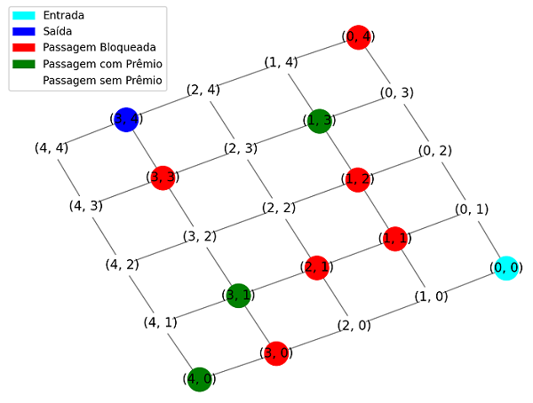

# Exercício Prático 02 (EP02)

Este repositório apresenta um template para a execução da avaliação EP02. O objetivo desta atividade é construir funções em Python, usando o pacote [NetWorkX](https://networkx.org/) que implementem as tarefas indicadas nas questões a seguir. Use a estrutura já disponível neste template. 

**Orientações Gerais**:
* Para carregar o submódulo `gtufcg`, execute os seguintes comandos no folder principal do repositório, após a clonagem:

      git submodule init

      git submodule update

* Não altere a estrutura do repositório ou modifique nomes dos arquivos ou folders;

* Não altere arquivos da pasta test ou workflows;

* Implemente as funções ou testes solicitados sem realizar qualquer alteração em sua assinatura (nomes e parâmetros), visto que esta avaliação terá como parte de sua correção a execução de testes automáticos;

* Os grupos devem implementar as soluções exclusivamente através da representação e manipulação de grafos usando NetworkX juntamente com construções gerais de Python quando indispensável;

* Apresente documentação (comentários no código) para descrever a solução desenvolvida. Evite documentar em excesso, apenas o mínimo necessário para facilitar a compreensão do código;

* Organize o código de forma consistente para facilitar sua legibilidade. Por exemplo, evite espaçamentos entre linhas ou identação inconsistentes; use nomes de funções/variáveis significativos;

* Cada grupo deverá realizar este trabalho de forma individual apresentando sua própria resposta. As respostas serão inspecionadas visualmente e mecanicamente com ferramentas especializadas. Nesta inspeção, caso seja detectada cópia de resposta, o(s) grupo(s) envolvido(s) sofrerão penalidade na nota e poderão ficar com nota 0;

* É importante salientar que é de responsabilidade do grupo manter o sigilo sobre sua solução. Para tal, não deixe sua solução em locais de visibilidade pública e acesso trivial;

* O trabalho deve ser realizado estritamente em grupo. A realização e entrega individual será penalizada com diminuição de 30% do valor da nota. Casos excepcionais, tais como assistência domiciliar ou desistência/indisponibilidade de membro(s) do grupo devem ser comunicados com antecedência.

**Entrega:**

* Realizar *push* com a versão final do repositório até o prazo definido na atividade do *Google Classroom*;
* Confira o status da execução automática dos testes na aba *Actions* no *GitHub*;
* Caso seu projeto contenha algum erro de compilação, nenhum teste será executado e, portanto, não poderá ser corrigido;
* A participação de cada membro será comprovada através do histórico de edições e *commits* do repositório. A nota será dada apenas para aqueles que editarem efetivamente o repositório utilizando o *login* específico atribuído no Team do github (conta vinculada ao seu @ccc.ufcg.edu.br);
* Caso o repositório seja editado após o prazo para entrega, a atividade será considerada como reposição.

## Questão 01

Esta questão considera o mesmo tipo de grafo de transações financeiras utilizado nas Questões 04 e 05 do EP01.
Encontrar padrões de fraude em um grafo de transações pode ser uma tarefa muito custosa devido ao tamanho do grafo.
Para reduzir o impacto desta busca, pode ser interessante realiza-la 
apenas em subgrafos que representam grupos de pessoas que realizaram transações, em uma ou
duas direções, para alguma pessoa daquele grupo. 

Por exemplo, considere o grafo de transações abaixo. Neste grafo, podemos encontrar dois grupos:

      {0,1,2,3,4,5,6} e {7,8,9,10}

O grupo será suspeito apenas se houverem transações entre membros deste grupo acima de um certo valor.

Escreva a função **warning_groups** que recebe como entrada um grafo `g` modelando transações bancárias, um limite mínimo de valor de transação suspeita `t` e um limite de tamanho de grupo `m`.  
A função retorna uma lista de listas com grupos de pessoas que realizaram pelo menos uma transação para alguma pessoa
do grupo, o grupo possui pelo menos uma transação maior ou igual a `t` e o tamanho do grupo é maior ou igual a `m`.

Como exemplo, considere o grafo anterior e a seguinte chamada:

      warning_groups(G1, 5000, 3)

a função retorna:
      
      [['10', '9', '8', '7']]

> Dica: Use o conceito de componentes fracamente conectados
      
**Arquivos**:
* src/Q01.py (local onde a função deve ser construída)
* test/test_Q01.py (testes automáticos)
* main_Q01.py (exemplo de uso da função)

**Execução dos testes automáticos** (use python ou a denominação específica para python na sua máquina):

      python -m unittest -v test/test_Q01.py

## Questão 02

Considere que uma certa área geográfica possui pontos de
interesse, isolados geograficamente, cuja localização pode ser representada em um plano
cartesiano por uma coordenada (x,y). Nesta área, 
a distância entre dois pontos $A$ e $B$ específicos pode ser calculada aproximadamente pela distância
entre as respectivas coordenadas no plano:

$d^2 = (x_B – x_A)^2 + (y_B – y_A)^2$

Estes pontos geográficos precisam ser conectados através da construção de estradas ou
ferrovias de tal forma que seja possível o deslocamento entre dois pontos quaisquer.
O custo de construção de um trecho de $A$ para $B$ é determinado pela distância. 
Para minimizar o custo da obra, é necessário encontrar a configuração de menor custo possível.
Para tal, cada ponto $A$ e $B$ deve ser conectado por exatamente um caminho e o somatório dos custos 
construção de cada trecho deve ser o menor possível.

Escreva a função **minimum_cost** que recebe como entrada um conjunto de coordenadas, `coordinates`, e retorna um fator 
que representa o custo mínimo para construção das vias de acesso.
Como exemplo, considere os pontos de interesse representados pelas seguintes coordenadas:

      C = [(0,1), (8,9), (4,3), (3,5)]

O grafo abaixo, representa estes pontos e as distâncias calculadas entre eles.

Para esta entrada a função deve retornar :12, considerando a construção dos trechos entre
os pontos: 

      ((0, 1), (4, 3))
      ((8, 9), (3, 5))
      ((4, 3), (3, 5))

> Dica: Use o conceito de árvore geradora.

**Arquivos**:
* src/Q02.py (local onde a função deve ser construída)
* test/test_Q02.py (testes automáticos)
* main_Q02.py (exemplo de uso da função)

**Execução dos testes automáticos** (use python ou a denominação específica para python na sua máquina):

      python -m unittest -v test/test_Q02.py

## Questão 03

Considere o problema de transformar um ou mais trechos de ruas de uma localidade de mão dupla para sentido único. Este problema pode ser modelado por um  dígrafo onde vértices representam os cruzamentos e os arcos representam as direções em cada trecho de uma rua, sendo o trecho mão dupla representado por dois arcos em sentidos opostos entre os mesmos cruzamentos. Caso não seja feita um planejamento adequado, pode não ser possível construir roteiros de ida e volta de um cruzamento a outro cruzamento qualquer. Sabemos que para quaisquer dois vértices do grafo estes são alcançáveis em ambas as direções desde que o grafo seja fortemente conectado.

Suponha que o departamento de transito possui um planejamento preliminar, mas que não constitui um grafo fortemente conectado. Neste caso, é necessário identificar que trechos de rua deveriam ser mão dupla a fim de torná-lo fortemente conectado. Mas a fim de minimizar a quantidade de trechos mão dupla, é importante restringi-los a trechos que conectam grupos que já estão fortemente conectados.

Escreva uma função, **arcs_to_connect**, que recebe um grafo direcionado fracamente conectado `g` como entrada e retorna
uma lista de possíveis arcos que podem ser adicionados para torna-lo fortemente conectado.
Caso o grafo seja fortemente conectado, a função deve retornar uma lista vazia.
Os candidatos devem fazer parte do grupo de arcos reversos do corte de entrada ou saída entre componentes fortes.  
Como exemplo, considere o seguinte dígrafo:

Este dígrafo possui os seguintes componentes fortes: {0,1,2} {3,4,5} {7}

A função deve retornar a seguinte lista de arcos candidatos (em qualquer ordem):

      [(5, 0), (3, 2), (4, 2), (7, 0)]

**Arquivos**:
* src/Q03.py (local onde a função deve ser construída)
* test/test_Q03.py (testes automáticos)
* main_Q03.py (exemplo de uso da função)

  **Execução dos testes automáticos** (use python ou a denominação específica para python na sua máquina):

      python -m unittest -v test/test_Q03.py

## Questão 04

"*Engrenagens são elementos mecânicos compostos de rodas dentadas que se ligam a eixos, aos quais imprimem rotação e torque, transmitindo assim potência.*" [Wikipedia](https://pt.wikipedia.org/wiki/Engrenagem)

Em um sistema de engrenagens, existem duas direções básicas de giro: horário e anti-horário. Duas engrenagens A e B engajadas sempre giram em sentido contrário uma da outra como mostra [esta animação](https://pt.wikipedia.org/wiki/Ficheiro:Gears_animation.gif). Por existirem apenas 2 sentidos, é impossível que um sistema de engrenagens gire caso exista um número ímpar de engrenagens engajadas em um círculo. Este caso é ilustrado na figura abaixo, onde é possível observar que o engajamento entre as engrenagens 1, 2, 3, 4 e 5 impedem que o sistema gire, já que necessariamente duas delas precisariam girar em um mesmo sentido o que é impossível.

Considere que um determinado sistema está modelado através de um grafo onde os vértices representam engrenagens e as arestas representam o fato de duas engrenagens estarem engajadas. Sabendo que o sistema pode girar e que uma engrenagem A gira um determinado sentido, horário (CW) ou anti-horário (CCW), é possível determinar o sentido em que qualquer outra engrenagem deste sistema irá girar.

Escreva a função **rotate_direction** que recebe como entrada:
* **g** - um grafo que modela um sistema de engrenagens
* **x** - o identificador de uma engrenagem
* **dx** - a direção em que a engrenagem *x* está girando
* **y** - o identificador da engrenagem a qual queremos determinar a direção de giro, onde **y** é diferente de **x**

A função retorna a direção em que **y** está girando e o fator de conservação de potência de **x** até **y**. Este fator é determinado como $\frac{1}{d}$, onde $d$ é a distância entre **x** e **y**. O fator deve ser arredondado para 2 casas decimais.

Como exemplo, considere o grafo abaixo e seja x = `c`, dx = "CW" e y = `g`. A função deve retornar como resultado "CCW" e 0.33 que representam a direção em que `g` gira e o fator de influência, respectivamente.

>Dica : Use busca em largura a partir do vértice **x**. Vértices em níveis consecutivos na árvore BFS giram em sentido contrário. Além do algoritmo bfs visto nas aulas, existem funções para bfs no pacote de algoritmos [traversal](https://networkx.org/documentation/stable/reference/algorithms/traversal.html#traversal).

**Arquivos**:
* src/Q04.py (local onde a função deve ser construída)
* test/test_Q04.py (testes automáticos)
* main_Q04.py (exemplo de uso da função)

  **Execução dos testes automáticos** (use python ou a denominação específica para python na sua máquina):

      python -m unittest -v test/test_Q04.py

## Questão 05

*Maze Solving* é um problema largamente estudado, especialmente na robótica, cujas soluções usualmente se baseiam em algoritmos de busca para grafos. Considere que um labirinto (*maze*) pode ser modelado por um [grafo grid](https://mathworld.wolfram.com/GridGraph.html), onde os vértices representam posições no labirinto e as arestas as ligações entre estas posições. Posições podem estar bloqueadas, impedindo a passagem pelas mesmas. Podem existir também posições onde prêmios podem ser coletados. Todo labirinto tem um vértice especial de entrada e um um vértice especial de saída. O problema geral consiste em encontrar um caminho de saída no labirinto a partir da entrada, ou seja, um caminho do vértice entrada ao vértice de saída, de qualquer tamanho. Neste caminho, posições não podem ser repetidas. Idealmente, o caminho deve viabilizar a coleta de tantos prêmios quanto possível.

Como exemplo, considere o labirinto modelado pelo grafo abaixo. Podemos observar que os vértices `(0,0)` e `(3,4)` representam as posições onde existe uma entrada e uma saída no labirinto, respectivamente. As posições `(0,4)`, `(1,1)`, `(1,2)`, `(3,3)`, `(1,2)`, `(2,1)` e `(3,0)` são posições cuja passagem está bloqueada; as posições `(4,0)`, `(3,1)`, `(1,3)` são posições de passagem com prêmio e as demais posições são de passagem sem prêmio.

Para este labirinto, o seguinte caminho permite entrar e sair do labirinto com a coleta de 2 prêmios, passando pelas posições `(3,1)`, `(1,3)`.

      [(0, 0), (0, 1), (0, 2), (0, 3), (1, 3), (1, 4), (2, 4), (2, 3), (2, 2), (3, 2), (3, 1), (4, 1), (4, 2), (4, 3), (4, 4), (3, 4)]

Observe que neste labirinto, não é possível coletar o prêmio da posição `(0,4)` visto que não existe um caminho que passe por ele (em um caminho não pode haver repetição de vértices).

Implemente a função **find_exit** que recebe como entrada um grafo grid (ver gerador de grafos [graph_2d_grid](https://networkx.org/documentation/stable/reference/generated/networkx.generators.lattice.grid_2d_graph.html#grid-2d-graph) de networkx) modelando um labirinto, onde vértices possuem um atributo `type` com um dos seguintes valores:

* 'B' - posição bloqueda
* 'I' - posição de entrada
* 'E' - posição de saída
* 'P' - posição de passagem com prêmio
* ' ' - posição de passagem sem prêmio

A função `build_grid` disponível no arquivo `src/Q05.py` pode ser utilizada para gerar instâncias deste tipo de grafo.

Caso seja possível entrar e sair do labirinto, a função retorna uma possível caminho, indicando a quantidade de prêmios que pode ser coletada e o caminho. Caso contrário, retorna um passeio vazio com 0 prêmios. Para construir o caminho, a função deve adotar uma heurística com base em:

* realizar uma busca em profundidade (DFS) a partir da posição de entrada até atingir a posição de saída ou visitar todos os vértices possíveis sem atingi-la;
* a cada passo, havendo mais uma posição a escolher para compor o caminho, escolher prioritariamente uma posição com prêmio;
* o critério de desempate deve sempre optar pela posição com menor coordenada: $(x,y) < (z,w)$ se $x < z$ ou $x = z \wedge y < w$. 

**ATENÇÃO**: A heurística estabelecida pelas condições acima nem sempre retorna um caminho que passa por todas as posições com prêmio, mas deve ser seguida pela função. Na solução desta questão *não é aceito o uso de funções que já computam caminhos inteiros*. É obrigatório realizar uma travessia do grafo usando DFS.

> Dica: Considere adaptar o algoritmo DFS visto nas aulas, desprezando as funções tempo. Quando o vértice de saída for atingido, o caminho pode ser obtido a partir da pilha (coleção na ordem inversa).

**Arquivos**:
* src/Q05.py (local onde a função deve ser construída)
* test/test_Q05.py (testes automáticos)
* main_Q05.py (exemplo de uso da função)

  **Execução dos testes automáticos** (use python ou a denominação específica para python na sua máquina):

      python -m unittest -v test/test_Q05.py
